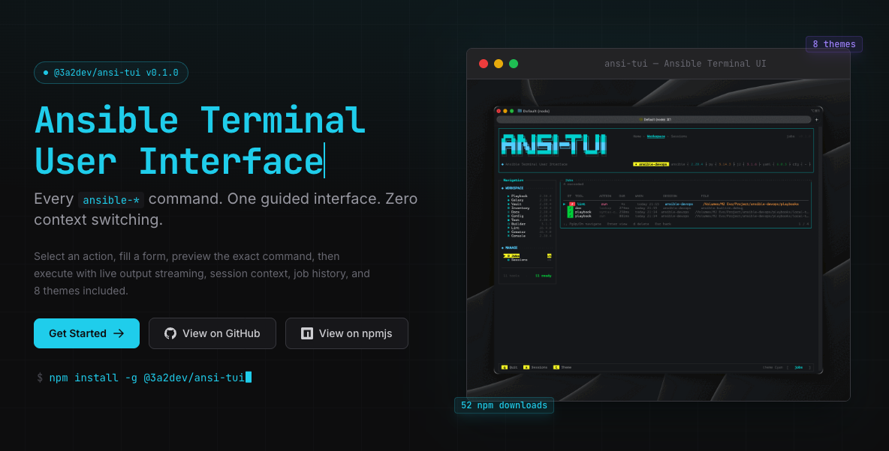

# ansi-tui showcase website




Showcase website for [`@3a2dev/ansi-tui`](https://github.com/3A2DEV/ansi-tui), built with Astro and deployed as a static site on Vercel.

This repository currently focuses on the website, not the terminal application itself. The site is designed to communicate the product clearly to Ansible engineers, platform teams, and enterprise operators with real product proof, terminal-native visuals, and minimal marketing noise.

## Website Scope

The current website presents:

- the guided 4-phase workflow used across the product
- coverage across the `ansible-*` toolchain
- session persistence and job history
- live execution output behavior
- enterprise-ready install and proxy support
- local-first storage and no-telemetry positioning
- keyboard-first terminal UX
- release and dependency visibility

## Product Snapshot

- Package: `@3a2dev/ansi-tui`
- Upstream repository: `https://github.com/3A2DEV/ansi-tui`
- License: `MIT`
- Runtime: `Node.js 18+`
- Deployment target: `Vercel`
- Site output: static

The website copy and structure are centered around these product claims:

- 11 interactive Ansible tools
- 60+ supported actions
- 8 built-in themes
- wizard-driven command generation
- exact command preview before execution
- live ANSI-aware output streaming
- persistent sessions and job history
- enterprise-friendly offline and proxy-aware workflows

## Current Stack

- Astro 5
- TypeScript
- Tailwind CSS
- React 18 islands for focused interaction only
- `astro-typewriter` for the animated hero headline
- Astro image pipeline for the primary demo media

## Implemented Routes

| Route | Purpose | Current content |
| --- | --- | --- |
| `/` | Overview landing page | Hero, stats bar, feature overview, workflow diagram, tool coverage, theme gallery, keyboard reference, install summary, FAQ, CTA |
| `/features` | Deep-dive detail page | Sessions, job history, live output, enterprise support, test/security messaging, dependency matrix |
| `/install` | Installation and environment guide | Install simulation, install method tabs, requirements, local storage layout, quality commands |
| `/changelog` | Release history | Structured release notes with links to GitHub releases and npm package versions |

## Current Page Details

### Home (`/`)

The homepage is the product overview page. It includes:

- animated terminal-native hero with product tagline and install command
- build-time npm download badge and summary stats
- feature overview grid
- static workflow diagram for the 4-phase flow
- tool coverage table rendered from typed data
- theme gallery rendered from typed data
- keyboard shortcut reference rendered from typed data
- install methods preview with interactive tabs
- FAQ accordion
- closing CTA section

### Features (`/features`)

The features page avoids repeating the full homepage and focuses on deeper product detail:

- session model and persisted workspace fields
- job history behavior and recorded metadata
- live output capabilities such as scroll, pause/resume, ANSI rendering, and clipping
- enterprise workflows including offline install and proxy override examples
- quality and security messaging
- dependency inventory for runtime and development packages

### Install (`/install`)

The install page focuses on practical setup details:

- interactive install method tabs
- animated install simulation
- runtime requirements and non-requirements
- local storage paths for macOS and Linux
- persisted data layout for sessions, history, and logs
- project quality commands users can run against the main package

### Changelog (`/changelog`)

The changelog page is currently data-backed from an in-page release structure and exposes:

- version number
- release date
- release label
- categorized Added and Fixed entries
- direct links to the matching GitHub release and npm package version

## Implemented Component Patterns

The site follows a mostly static Astro architecture with a small number of targeted interactive islands.

### Shared structure

- `website/src/layouts/Base.astro` provides the shared shell, metadata, canonical URLs, Open Graph tags, Twitter tags, favicon, and global stylesheet import.
- `website/src/components/Header.astro` and `website/src/components/Footer.astro` provide shared navigation and footer structure.
- `website/src/styles/global.css` contains the global visual system and reusable terminal framing utilities such as terminal window chrome, badges, and code block presentation.

### Static Astro components

- `Hero.astro`
- `StatsBar.astro`
- `FeaturesGrid.astro`
- `WorkflowDiagram.astro`
- `ToolCoverage.astro`
- `ThemeGallery.astro`
- `KeyboardRef.astro`
- `DependencyMatrix.astro`
- `InstallSimulation.astro`

### Interactive islands

- `InstallTabs.tsx`
- `FAQAccordion.tsx`
- `InstallSimulation.tsx`

React is used only where interaction adds real value. The rest of the site stays static for clarity, performance, and deployment simplicity.

## Typed Content Model

The website is intentionally data-driven where practical.

- `website/src/data/tools.ts` defines the 11-tool coverage table and action counts.
- `website/src/data/themes.ts` defines the 8 theme cards and preview palettes.
- `website/src/data/shortcuts.ts` defines global, form, and execution keyboard shortcuts.
- `website/src/data/faq.ts` defines the FAQ content used on the homepage.
- `website/src/data/dependencies.ts` defines the runtime and development dependency inventory shown on `/features`.

This keeps content structured, reusable, and easier to maintain as the product evolves.

## Build-Time Behavior

- The site uses canonical URLs derived from `Astro.site`.
- Open Graph and Twitter metadata default to `banner.png`.
- The favicon is `website/public/3a2dev.svg`.
- The hero and stats bar fetch npm download counts from the npm API at build time.
- If the npm API is unavailable during build, those components fall back to generic labels instead of failing the site build.

## Repository Structure

```text
showcase-website.md   Product and content brief
screenshot.png        Source screenshot asset
last-rec.gif          Source demo recording asset
website/              Astro application
  public/             Static assets served directly
    3a2dev.svg        Current favicon source
    banner.png        Hero / social preview base image
    demo.gif          Primary demo media used in the hero
    favicon.svg       Legacy favicon asset
    run.gif           Additional demo asset
    theme-cycle.gif   Theme switcher demo asset
  src/
    components/       Reusable Astro and React UI pieces
    data/             Typed website content and inventories
    layouts/          Shared page shell and metadata
    pages/            Route files
    styles/           Global CSS and terminal visual utilities
  package.json        Astro app scripts and dependencies
```

## Content Sources

Primary source of truth:

- `showcase-website.md`

Additional sources that should inform the site when present:

- `README.md`
- `CONTRIBUTING.md`
- changelog entries
- screenshots and recorded product demos

## Local Development

Run all website commands from `website/`:

```bash
npm install
npm run dev
```

Useful supporting commands:

```bash
npm run check
npm run build
npm run preview
```

## Known Gaps

- `/docs` is not implemented yet.
- `/contributing` is not implemented yet.
- Dedicated social preview assets are not implemented yet. The site still uses `banner.png`.
- Feature subpages under `/features/*` do not exist yet.
- Copy and visual proof should be refined again as package docs and contributor docs expand.

## Near-Term Priorities

1. Add `/docs` and `/contributing` once source material exists.
2. Add dedicated social preview assets and richer metadata.
3. Add more product-proof visuals beyond the current screenshot and recording assets.
4. Re-evaluate whether `/features/*` subpages are needed or whether the single `/features` page remains the right depth.
5. Continue tightening copy as the main package documentation grows.
